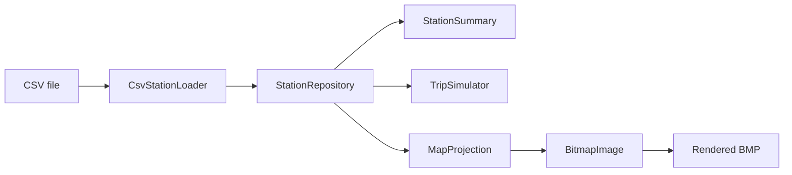

# Bike-Share Visual Monitor — Modern C++

[](#)
[](#)
[](LICENSE)

[](https://github.com/Waldo0926/bike-share-visualizer-cpp/actions/workflows/ci.yml)

[中文说明](README.zh-CN.md)

A command-line tool for loading, querying and visualising a city
bike-share network, written in modern C++17.

This project began as an object-oriented-programming coursework
submission by **Shuoxun Wen (温硕勋)** during my earlier undergraduate
studies: an MFC desktop application titled *城市公共自行车运营可视化数据监控系统*
("City Public Bike-Share Operations Visualisation Monitoring System"),
built against a real 588-station Chicago Divvy dataset. I revisited and
modernised it in 2026 to fix a set of correctness bugs, lift the core
logic out of a Windows-only GUI, and put it under real automated tests.

> The original coursework is preserved in [`legacy/`](legacy/). The main
> codebase is a modern reimplementation of the same data pipeline, not a
> cosmetic rewrite of the old file.

## Highlights

- CSV loader that detects and skips the header row, handles quoted
  fields, validates every numeric column, and distinguishes a bad path
  from a file with no usable rows
- GPS-to-pixel map projection extracted into one configurable class
  instead of a magic-number formula duplicated four times
- Station lookup by ID or name, plus aggregate dock and service stats
- Random two-station trip simulation with an injectable random source
  and a bounded retry loop, so it cannot spin forever
- A dependency-free BMP reader/writer that renders every station onto
  the original calibrated map image, and reports stations that project
  outside the map area instead of silently dropping them
- 17 tests via CTest, including integration tests over the real dataset,
  run on Ubuntu, macOS and Windows in CI
- Zero third-party dependencies

## Then and now

The original MFC application, plotting all stations and animating a
simulated rider's trip between two of them:

| Station overview | Simulated trip |
| --- | --- |
|  |  |

The modernised renderer, run headlessly against the same dataset and the
same calibrated map image:

<p align="center">
  
</p>

Comparing the two turned out to be useful rather than decorative: the
statistics panel in that first screenshot reports **589** stations and
**1** out of service, while the modern loader reports 588 and 0 from the
same file. The dock totals agree exactly, which is what identifies the
difference as the CSV header row being parsed as a station. That, and
seven other issues, are worked through in
[`docs/MODERNISATION.md`](docs/MODERNISATION.md).

## Data model

```cpp
struct Station {
    std::string id;
    std::string name;
    std::string address;
    int totalDocks;
    int docksInService;
    std::string status;
    double latitude;
    double longitude;
};
```

## How the pipeline works



See [`docs/DESIGN.md`](docs/DESIGN.md) for what each module owns.

## Building

```
cmake -S . -B build -DCMAKE_BUILD_TYPE=Release
cmake --build build
ctest --test-dir build --output-on-failure
```

Requires a C++17 compiler and CMake 3.16+. No third-party dependencies.

On Windows, the Visual Studio generator places the built executable under a
per-configuration folder rather than directly in `build/`, so the CLI
examples below become `build\Release\bikeviz.exe` (or `build\Debug\...`
for a debug build) instead of `build/bikeviz`.

## Using the CLI

```
# Load the bundled dataset and print summary stats
./build/bikeviz --csv data/chicago_bike_stations.csv

# Look up a station by ID or by exact name
./build/bikeviz --csv data/chicago_bike_stations.csv --find-id 246
./build/bikeviz --csv data/chicago_bike_stations.csv --find-name "Ridge Blvd & Howard St"

# Simulate a random two-station trip
./build/bikeviz --csv data/chicago_bike_stations.csv --simulate

# Render every station onto the calibrated map image
./build/bikeviz --csv data/chicago_bike_stations.csv \
  --map data/map.bmp --out rendered_map.bmp
```

## Project layout

```
include/bikeviz/   public headers for the core library
src/               core library implementation + CLI entry point
tests/             CTest-driven unit and integration tests
data/              Chicago Divvy station CSV and the calibrated map image
legacy/            the original 2021 MFC coursework project, unmodified
docs/              design notes, modernisation write-up, screenshots
```

## License

MIT — see [LICENSE](LICENSE). The bundled dataset, map image, and legacy
project carry their own notes in
[THIRD_PARTY_NOTICES.md](THIRD_PARTY_NOTICES.md).
