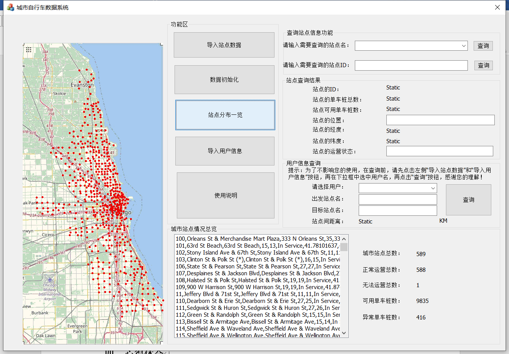
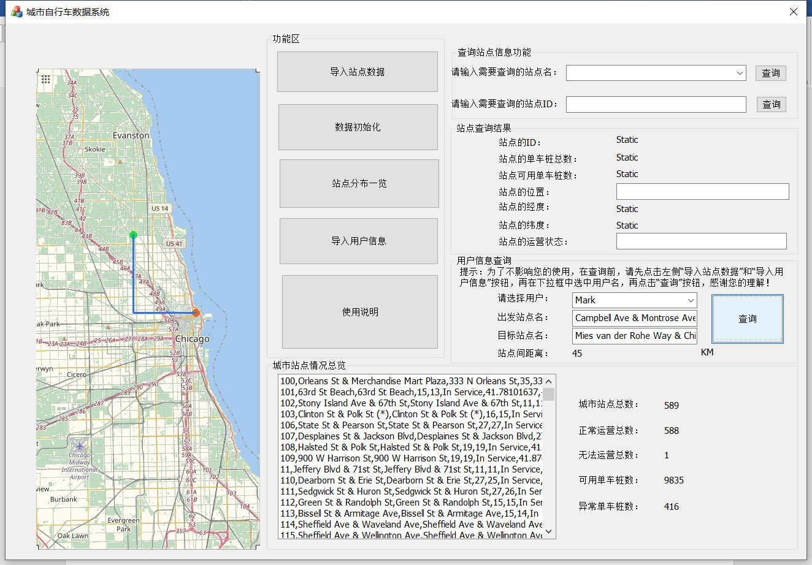
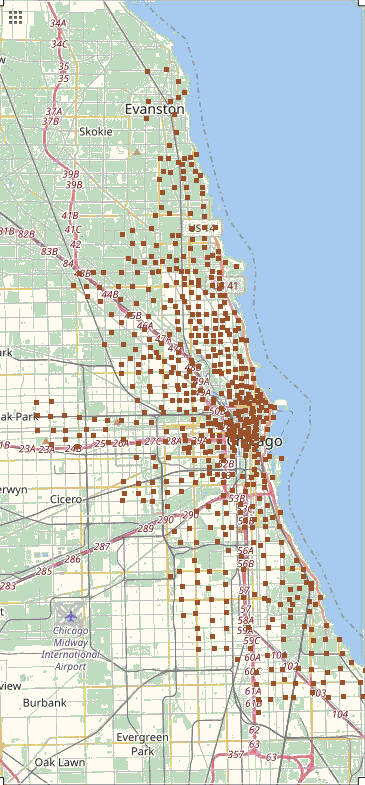

# Bike-Share Visual Monitor — 现代 C++ 重构版

[](https://github.com/Waldo0926/bike-share-visualizer-cpp/actions/workflows/ci.yml)

[English](README.md)

一个用现代 C++17 编写的命令行工具，用来加载、查询和可视化一个城市共享单车网络的站点数据。

这个项目的前身是我本科阶段面向对象程序设计课程设计的提交作业：一个基于 MFC 的 Windows 桌面程序，题目是《城市公共自行车运营可视化数据监控系统》，当时用的是真实的芝加哥 Divvy 共享单车站点数据（588 个站点）。2026 年我重新审视并重构了这个项目，修复了一批正确性问题，把核心逻辑从只能在 Windows 上跑的 GUI 里剥离出来，并且补上了真正的自动化测试。

> 原始课设代码完整保留在 [`legacy/`](legacy/) 目录下。主代码库是对同一套数据处理流程的现代重写，而不是把旧文件简单改改样式。

## 项目亮点

- CSV 加载器能正确识别并跳过表头行，处理带引号的字段，校验每一列数值，并且能区分"路径不存在"和"文件能读但没有有效数据"两种情况
- 把原来重复出现四次的坐标转换魔数公式，抽成了一个可配置的类
- 支持按 ID 或名称查询站点，以及聚合的车桩和运营状态统计
- 随机双站点行程模拟，随机源可注入、重试次数有上限，不会死循环
- 零依赖的 BMP 读写实现，能把所有站点渲染到原始的校准地图上，遇到投影超出地图范围的站点会主动报告，而不是悄悄丢弃
- 通过 CTest 跑了 17 个测试，其中包含针对真实数据集的集成测试，并在 CI 里跑通 Ubuntu、macOS、Windows 三个平台
- 零第三方依赖

## 前后对比

原始 MFC 程序运行时的样子：把所有站点画在地图上，并动画演示两个站点间的模拟行程。

| 站点总览 | 模拟行程动画 |
| --- | --- |
|  |  |

现代版本用同一份数据、同一张校准过的地图图片，以无界面方式跑出来的渲染结果：

<p align="center">
  
</p>

对比这两张图发现了一件挺实用的事：第一张截图里的统计面板显示的是 **589** 个站点、**1** 个无法运营，而现代版本对同一份文件给出的是 588 和 0。车桩总数两边完全吻合，这正好证明了差异来自 CSV 表头行被误当成了一条站点数据。这个问题连同另外七个问题，都在 [`docs/MODERNISATION.md`](docs/MODERNISATION.md)（英文）里详细写清楚了。

## 数据模型

```cpp
struct Station {
    std::string id;
    std::string name;
    std::string address;
    int totalDocks;
    int docksInService;
    std::string status;
    double latitude;
    double longitude;
};
```

## 数据处理流程


每个模块具体负责什么，见 [`docs/DESIGN.md`](docs/DESIGN.md)（英文）。

## 构建方法

```
cmake -S . -B build -DCMAKE_BUILD_TYPE=Release
cmake --build build
ctest --test-dir build --output-on-failure
```

需要支持 C++17 的编译器和 CMake 3.16 以上版本，没有第三方依赖。

## 使用命令行工具

```
# 加载内置数据集并打印汇总统计
./build/bikeviz --csv data/chicago_bike_stations.csv

# 按 ID 或精确名称查询站点
./build/bikeviz --csv data/chicago_bike_stations.csv --find-id 246
./build/bikeviz --csv data/chicago_bike_stations.csv --find-name "Ridge Blvd & Howard St"

# 模拟一次随机的双站点行程
./build/bikeviz --csv data/chicago_bike_stations.csv --simulate

# 把所有站点渲染到校准过的地图图片上
./build/bikeviz --csv data/chicago_bike_stations.csv \
  --map data/map.bmp --out rendered_map.bmp
```

## 项目结构

```
include/bikeviz/   核心库的公开头文件
src/               核心库实现 + 命令行入口
tests/             基于 CTest 的单元测试和集成测试
data/              芝加哥 Divvy 站点数据 CSV 和校准过的地图图片
legacy/            2021 年原始 MFC 课设工程，未做任何修改
docs/              设计说明、重构记录、截图
```

## 许可证

MIT — 详见 [LICENSE](LICENSE)。
