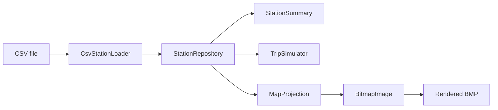

# Design

## Goals

Split the original single MFC dialog class (which mixed file I/O, string
parsing, coordinate math, GDI drawing and UI event handling in one place)
into small, independently testable pieces with no platform or UI
dependency, wrapped by a thin CLI.

## Modules

- **`Station`** — a plain data struct mirroring the eight CSV columns
  (ID, name, address, total docks, docks in service, status, latitude,
  longitude). No behaviour beyond `isInService()`.

- **`CsvStationLoader`** — turns a CSV file into `Station` values. Owns
  all the string-parsing concerns the original program scattered through
  a button handler: quoted-field splitting, header detection, and
  per-row validation with a warning instead of a crash or silent zero.
  Returns `fileOpened` alongside the rows so a caller can tell a bad
  path from a file that simply had nothing usable in it.

- **`StationRepository`** — an in-memory index over a loaded station
  list. Provides `findById`, `findByName` and `summary()` so the two
  near-duplicate linear-search handlers in the original code become one
  tested implementation.

- **`MapProjection`** — the GPS-to-pixel affine transform, extracted from
  a magic-number one-liner into a small class with named, overridable
  parameters (origin longitude/latitude, per-axis scale).

- **`TripSimulator`** — random two-station trip selection and the
  "Manhattan-ish" trip distance estimate, with the random source injected
  so the separation heuristic is testable without depending on
  `std::rand()`.

- **`BitmapImage`** — a small self-contained BMP reader/writer (8-bit
  palette or 24-bit input, 24-bit output) so station markers can be
  rendered onto the original map image outside of a live Win32 window,
  and the result can be opened in any image viewer or embedded in a
  README. `drawMarker` clips out-of-bounds markers rather than throwing,
  but returns whether the marker actually landed on the canvas, so the
  caller can report stations that fall outside the map's calibrated area
  instead of losing them the way a clipping Win32 device context did.

## Testing strategy

`tests/bikeviz_tests.cpp` deliberately uses a plain `require()` helper
and a table of test functions rather than pulling in a framework — the
suite is small enough that a dependency would cost more than it saves,
and it keeps `cmake && ctest` working on a clean machine with no network.

The tests come in two layers:

- **Unit tests** cover each module against small hand-built inputs,
  including the failure paths that the original program did not have:
  malformed CSV rows, a missing file, an off-canvas marker, and a
  dataset where the trip heuristic can never be satisfied. Randomness is
  injected (`RandomIndexFn`) so trip selection is deterministic here.
- **Integration tests** run the real 588-station CSV and the real map
  image through the whole pipeline, asserting the exact dock totals the
  original program displayed (9835 in service, 416 out) and the exact
  587/1 split of stations that do and do not project onto the map. These
  are what would catch a regression in the projection constants or the
  parser that a synthetic three-row fixture would sail straight past.

CMake passes the data directory in as `BIKEVIZ_DATA_DIR` so the
integration tests locate their fixtures regardless of where the build
directory is, which is also what lets them run unchanged on all three
CI platforms.

## Why a CLI instead of a GUI

The original assignment's point was the visualisation, which the CLI's
`--map`/`--out` flags still produce (see the rendered screenshot in the
main README). A GUI front-end was left out on purpose: MFC only builds on
Windows, and reproducing the same window in, say, Qt or Dear ImGui would
have meant writing a second, parallel UI layer without adding anything to
the part of the project that's actually being demonstrated here — the
data pipeline and the coordinate math. The core library has no
dependency on any UI toolkit, so a GUI could be layered on top of it
later without touching `bikeviz_core` at all.
